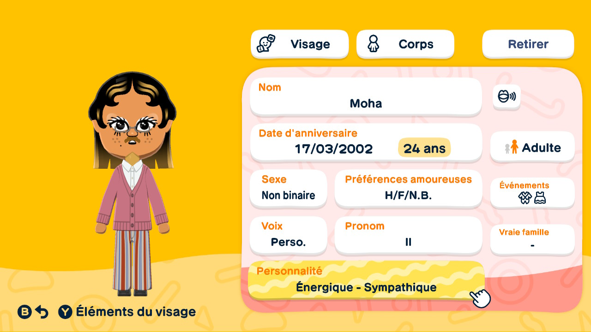
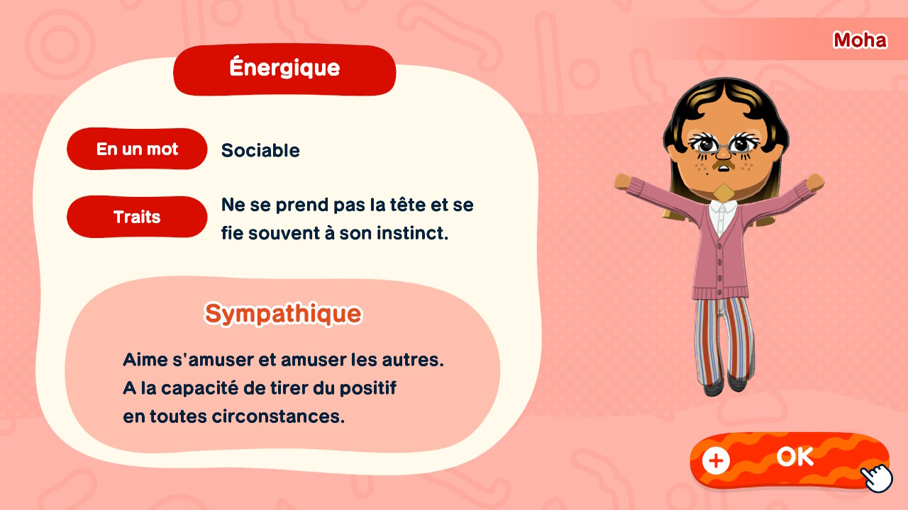
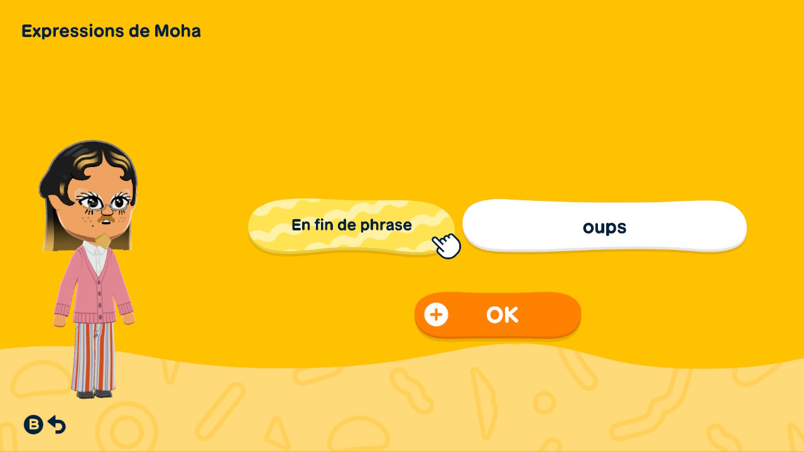
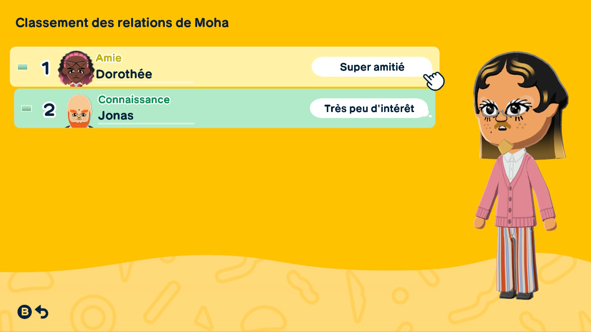

# Moha

>> Moha's informations, in french (don't worry I'll translate them in this doc)

> Because of the fact that he's genderfluid, he got the non-binary genre but I can switch pronouns so I'll do it if he's showing more androginy

Moha is a genderfluid French Maghrebi. For the moment, he gotthe male pronoun but it is possible to change it if I observ more androgyny from him. His family is from Casablanca, Morocco and immigrated because of french colons that came in 1912. His grandparents went in Paris with their parents because of the first world war when France had to get military forces. They were the base of the Morrocan diaspora. Moha always lived in middle-class Paris but also made a lot of trips to Casa to meet his roots. Because all of this, he really love the singer Ino Casablanca and his lovely "MOULA SOLITUDE" song.

Moha and Dorothée have much in similar in their family story and I think this is a reason of why they connected so much.

Moha is the name given by his parents.

I love the voice I made for him I find it matches really well with his face.

He was born on 17/03/2002. He is so 24.

He is tall but not the tallest, he is around 1m80.

He can love anybody and can wear any suit or dress for events.

## Personnality

Moha is energic, the red category.

In one word, he is sociable.

He doesn't worry much and often trust his instincts.

In the "energic" category, Moha is considered as friendly. He likes having fun and entertaining other Miis. He have the ability to find positivity in every circumstances.

## Favorite/Hated food

> Doesn't have yet

## Word/Physical quirks

> No Physical quirks yet

- He adds "oups" at the end of almost each sentence he says.

## Relationships

- Dorothée : Friends because of the "gode xxl dragon" and the plot armor of the demo. He calls her Dodo.

- Jonas : they two have potential to be really good friends but for now they just know each other because Moha helped Jonas getting up after they fell.

## Jobs spotted

- Grocer.
- Journalist.