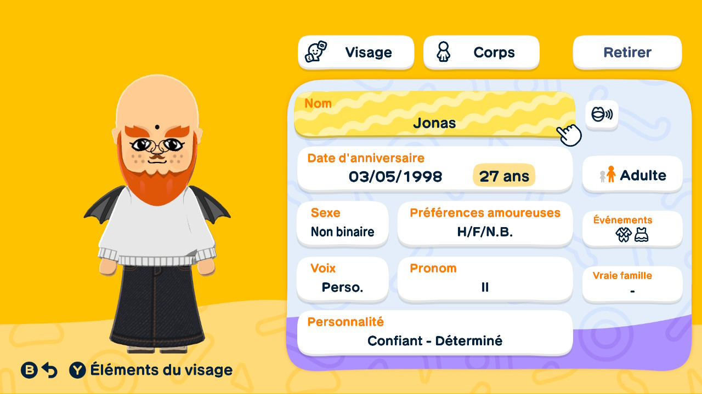
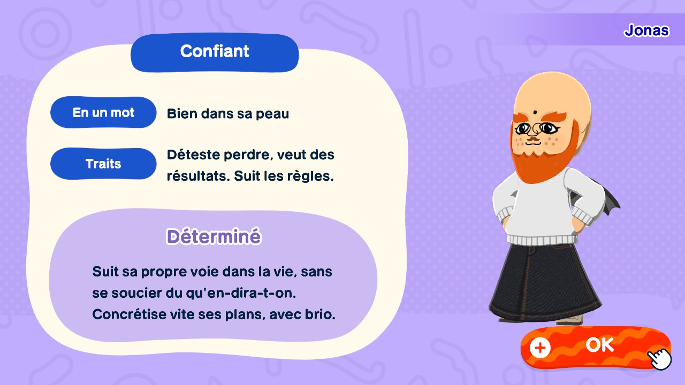
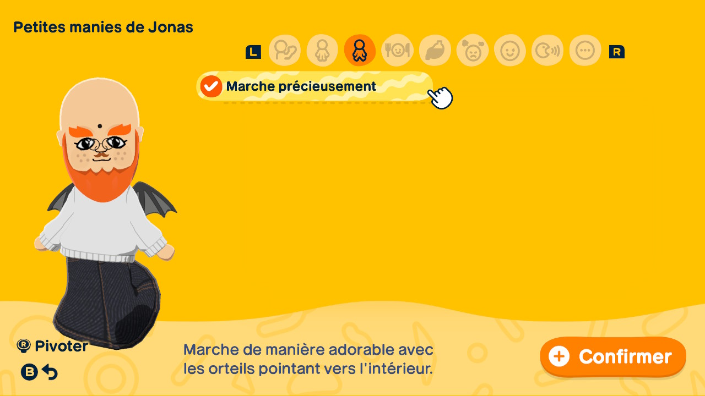
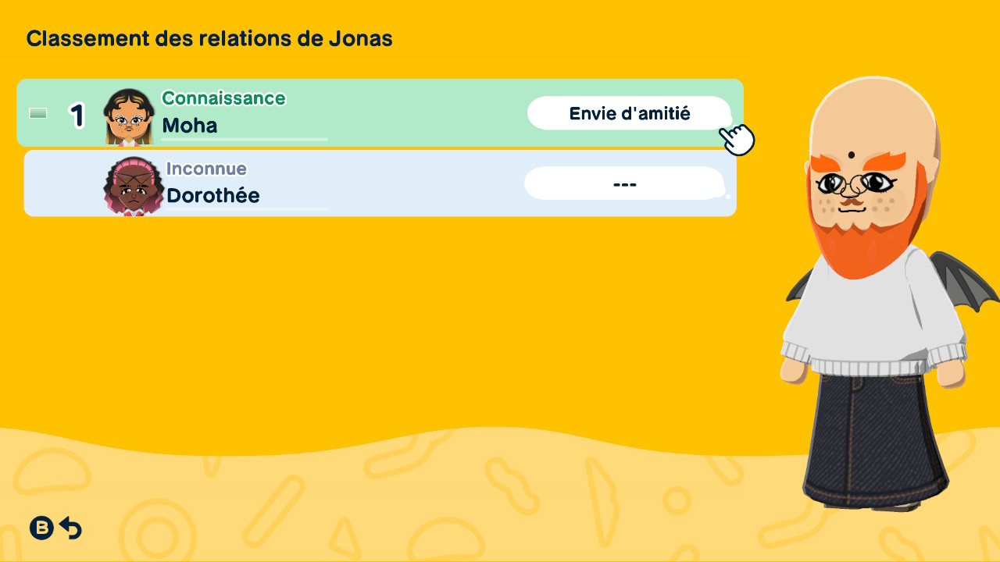

# Jonas

>> Jonas's informations, in french (don't worry I'll translate them in this doc)

Jonas is a non-binary French. Their family is from Dunkirk, France. They don't really know Paris well exept with what they see on twitter and instagram. They is unemployed even if their family wants them to become farmer on the outskirts of dunkirk like them. But Jonas doesn't like it so they went to the island. They were plug on the underground Dunkirk rap scene. They wasn't friend with the artists but they saw all Gemroz's concerts and love him and his famous song "GEM KARSON" with Ptite Soeur.

Jonas is the name given by their parents.

Ok so I love their voice and hate it at the same percentage. The random voice made something weird and I used 1 or 2 parameters and it renders weird lol I laugh every time we talk.

They was born on 03/05/1998. They is so 27.

They is the tallest for the moment and they is really tall, they is around 1m95.

They can love anybody and can wear any suit or dress for events.

> If I was in an english or japanese game I could give them a neutral pronoun but I'm french and we can't so I gave them the male pronoun, but here they will be congugate with the neutral pronoun "they"

## Personnality

Jonas is confident, the blue category.

In one word, they is comfortable in his skin (french expression) (yes there are more words than one).

They hate losing, want results, follow the rules.

In the "confident" category, Jonas is considered as determined. They follow their own path in life, without worrying about what anyone will say. They quickly bring their plans to fruition brilliantly.

## Favorite/Hated food

> Doesn't have yet

## Word/Physical quirks

- Preciously walks.

> No Word quirks yet

## Relationships

- Moha : they two have potential to be really good friends but for now they just know each other because Moha helped Jonas getting up after they fell.

- Dorothée : Doesn't know them for the moment.

## Jobs spotted

- (MAYBE) Clothes shopper but we don't see them exept when Moha presented the shop at the BREAKING NEWS.