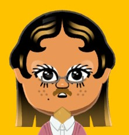
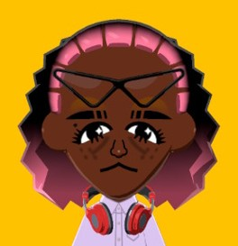
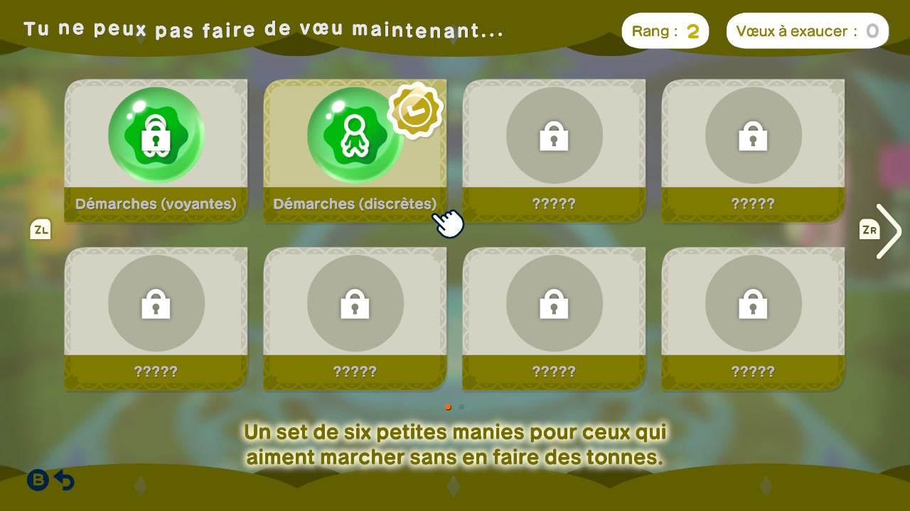
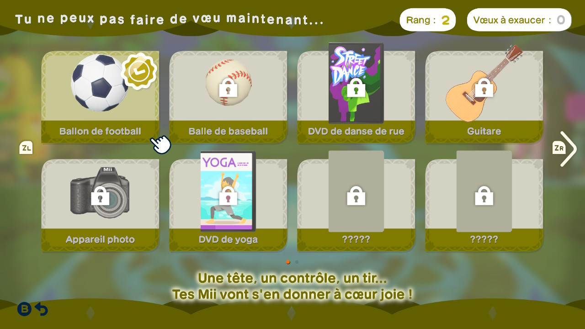
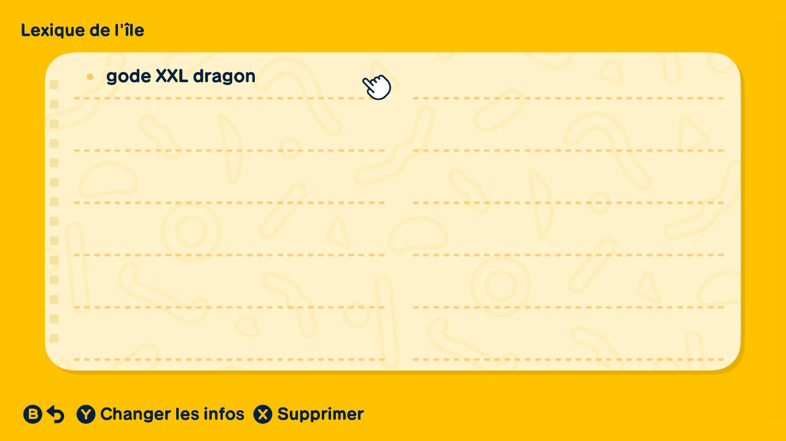
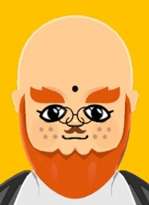
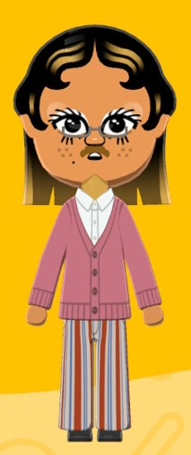
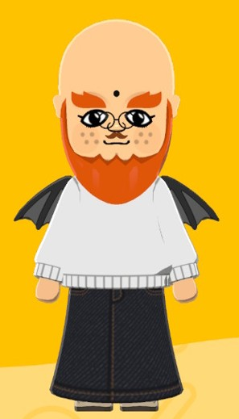
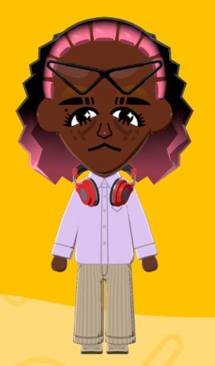

# Day 1
 
28/03/2026

Okay so... just did the Demo version when I write this and here are all the things I saw and did

.jpg)
>> The Mii presenting the Island is my third Mii, Jonas

My island is "Antares Island". It's a reference of a company making DAW plug-ins and the most famous is Autotune. This is because I make music on FL Studio. I don't know if I'll change I find it pretty well

My Miis call me "Gros" wich is the litteral translation of "fat" in french but it's also an affective way to call friends in the familiar language. That's an equivalent of "bro" even if we use it too in french with the words "frère" and "frérot"

I created [Moha](../Characters/1-Moha/Presentation.md) first. Click [here to see their presentation](../Characters/1-Moha/Presentation.md)

>> Moha, my first Mii

I was first surprised that even if he was alone on the Antares island, he became the journalist AND the grocer of the island. I mean, one job is enough but bro decided to have two important roles immediatly #wow

He was feeling alone so I created [Dorothée](../Characters/2-Dorothée/Presentation.md) to make sure he won't be bored

>> Dorothée my second Mii

When she arrived, the "Wishes Fountain" appeared and I upgraded to the second level. Then, I obtained the "Light quirks".

I also fed Moha and upgraded the fountain to the next level and I obtained a football ball (yes USians, FOOTBALL ! WE SAY FOOTBALL NOT SOCCER)

Personnalities of Moha and Dorothée weren't really compatible but apparently they became friends. (I think the game forces the friendship, and even if it sounds really bad said like that I think this is better than waiting forever to create a relation naturally)

Moha asked me to talk about something with Dorothée and I said him to talk about "gode XXL dragon". Make your own researches.

>> Their friendship is based on this... 

Moha then did his second BREAKING NEWS, (don't remember the first sorry), noticing me that I could invite a third habitant on the Antares island.

So, I created my final Mii authorized for the demo version, [Jonas](../Characters/3-Jonas/Presentation.md) !

>> Jonas, my third Mii

When they arrived, The clothes shop was created, I'll see it later.

I gave them princess quirks because they is the absolute Queen of the island to my eyes 

>> Jonas being the Queen

Dorothée was sleeping on the fountain, talking to her made me enter her dreams. It was really weird, it was about her at the limit to the void, praying me to not push her. So, I pushed her and she fall from really high on the island. Fortunately, she was attached like a bungee jump and did not die. She woke up and asked what happenned lol.

Jonas was running and fell. I took Moha to help them, Jonas thanked them and they all two came back home.

Moha's problem was that he "wasn't cool enough for the island" and he wanted some clothes. I went in the clothes store AND COOKED A MASTERPIECE FOR HIM. I also took headphones for Dorothée because their vibe was matching the energy of the headphones

When Moha obtained his outfit and put it on him, he immediatly claimed the demo finished and the Miis would stay in their houses until I buy the complete game and they will then be transfered to the complete game. I knew it because of twitter but I was still sad :/

Moha showed me little trailers. I forgot two but one stood out to me. Dorothée and Jonas were running on the beach and Jonas was SPLENDID in their outfit. They was wearing a floral dress and they was so slaying in it I decided their clothes would be "feminine-typed" in majority. Dorothée was stunning in her pants and shirt so I decided that their clothes would be "masculined-typed" in majority, also to make an opposition for Jonas.

> (I say masculine and feminine because capitalism and patriarchy imposed it on us and it's way much more clear to understand and yes I want these terms to disappear)

After these little trailers, I so went to the clothes store to make outfits for Jonas and Dorothée after my little decisions.

And here I stopped my session to talk here, see you [Day 2](DAY-2.md) !!! It will be when I'll have the complete game.

--- 

## Recap

Nobody had discover hated food or favorite food today

Moha and Dorothée are Friends

Moha and Jonas know each other a bit

Love the game !
